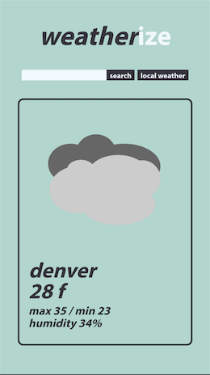

# Weatherize

A react based weather app with custom icons, local conditions based on geo location data from the browser and a city search option.

# Technology used

React

Open Weather API

# Future Development

Error handling

Icons need to stay centered and darkened

5-day forecast

Desktop styling

# Links

Deployed App[Weatherize](https://quirky-hermann-a6ee0b.netlify.app/)

Github Repo [Weatherize](https://github.com/MatteoThomas/weather_app_react)

# Contributors

Matthew Elliott

# License

MIT
